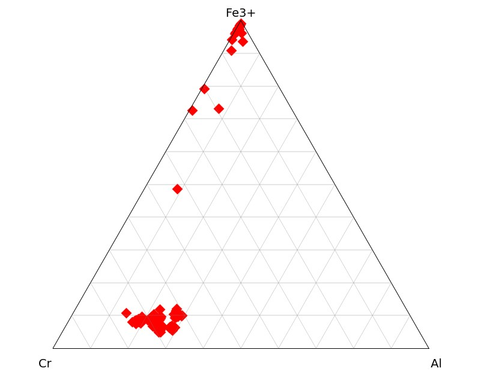

# ternary_plot
A little piece of python code to plot data as ternary plot, very useful in geosciences

**The function is called "ternary_plot" :**

*df_in = imported dataframe*

*abc_headers = list of 3 str referring to df columns headers*

*norm= 'yes' or 'no' depending if you need to normalize your data before plotting or if you did it yet.*

*corner_labels = add some labels to each ternary plot corner*

*title = a title to your plot*

*ticks = for % reference*

Here's an example of spinel composition analyzed in ultramafic rock samples from Morocco

Link to the paper for information:

Hodel, F., Triantafyllou, A., Berger, J., Macouin, M., Baele, J. M., Mattielli, N., (...) & Poujol, M. (2020). The Moroccan Anti-Atlas ophiolites: Timing and melting processes in an intra-oceanic arc-back-arc environment. Gondwana Research, 86, 182-202.

https://www.sciencedirect.com/science/article/abs/pii/S1342937X20301787
